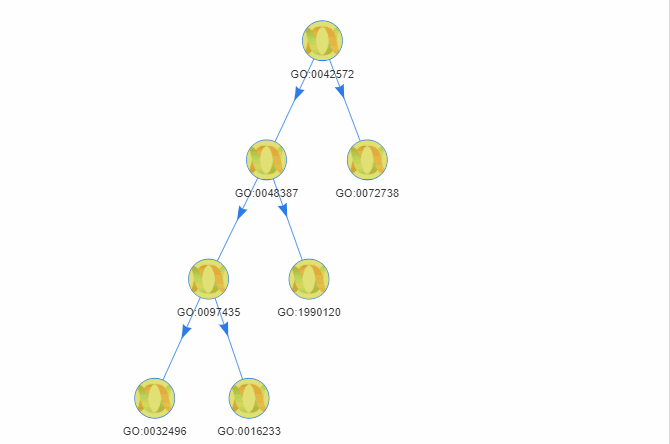

<!-- README.md is generated from README.Rmd. Please edit that file -->

```{r setup, include = FALSE}
knitr::opts_chunk$set(
  collapse = TRUE,
  comment = "#>",
  fig.path = "man/figures/README-",
  out.width = "100%"
)

library(knitr)
hook_output <- knit_hooks$get("output")
knit_hooks$set(output = function(x, options) {
  lines <- options$output.lines
  if (is.null(lines)) {
    return(hook_output(x, options))  # pass to default hook
  }
  x <- unlist(strsplit(x, "\n"))
  more <- "..."
  if (length(lines)==1) {        # first n lines
    if (length(x) > lines) {
      # truncate the output, but add ....
      x <- c(head(x, lines), more)
    }
  } else {
    x <- c(more, x[lines], more)
  }
  # paste these lines together
  x <- paste(c(x, ""), collapse = "\n")
  hook_output(x, options)
})
```

# CrossSCC

The goal of CrossSCC is to classify **S**ingle-**C**ell data(as expression matrix of scRNA-seq data) **Cross**ing batch into **C**lusters using Gaussian Mixture Model, and to find out the mapping relationship in clusters.


## Installation

You can install the latest version of CrossSCC with:

```r
install.packages("remotes")
remotes::install_github("bioinformatist/CrossSCC")
```

Besides, you also need a database [org.HsSimple.eg.db](https://github.com/bioinformatist/org.HsSimple.eg.db) provided by us: First download the [latest release tarball](https://github.com/bioinformatist/org.HsSimple.eg.db/releases), then run:

```r
install.packages("./org.HsSimple.eg.db", repos=NULL)
```

## Example dataset

### Seven cell types

This dataset is part of [GSE81861](https://www.ncbi.nlm.nih.gov/geo/query/acc.cgi?acc=GSE81861) from [this paper](https://www.nature.com/articles/ng.3818#accessions). First, the FPKM matrix file of all cells was downloaded:

```bash
aria2c ftp://ftp.ncbi.nlm.nih.gov/geo/series/GSE81nnn/GSE81861/suppl/GSE81861_Cell_Line_FPKM.csv.gz
pigz -d GSE81861_Cell_Line_FPKM.csv.gz
```

Then pre-process dataset in R:

```r
library(data.table)
library(tidyverse)
library(org.Hs.eg.db)
library(usethis)
library(genefilter)
library(Biobase)
cl <- fread('GSE81861_Cell_Line_FPKM.csv')
names(cl)[1] <- 'Gene'
cl[, Ensembl := str_match(Gene, ".+_(.+)\\.\\d+$")[, 2]]
symbols <- mapIds(org.Hs.eg.db, keys = cl$Ensembl, keytype = "ENSEMBL", column="ENTREZID", multiVals = 'first')
cl[, Entrez := symbols[Ensembl]]
cl[, c('Gene', 'Ensembl'):= NULL]
cl <- cbind(cl[, .(Entrez)], cl[, .SD, .SDcols = !(names(cl) %like% "_B2_")])
cl[, var := rowVars(.SD), .SDcols = -c('Entrez')]
cl <- cl[, max.var := max(var), by = 'Entrez'][var != 0 & max.var == var & !is.na(Entrez), ]
cl[, grep("var", colnames(cl)) := NULL]
cl <- as.data.frame(cl) %>% remove_rownames %>% column_to_rownames(var = "Entrez")
cl <- cl[, !(names(cl) %in% 'Entrez')]
cl.7 <- new("ExpressionSet", exprs=as.matrix(cl), annotation = 'org.Hs.eg.db')
# setwd() back to package root directory
use_data(cl.7, compress = 'xz')
```

### Immune Cells

From this [research article](https://doi.org/10.1016/j.cell.2019.10.003) coming with [GSE140228](https://www.ncbi.nlm.nih.gov/geo/query/acc.cgi?acc=GSE140228):

```bash
aria2c ftp://ftp.ncbi.nlm.nih.gov/geo/series/GSE140nnn/GSE140228/suppl/GSE140228_read_counts_Smartseq2.csv.gz
pigz -d GSE140228_read_counts_Smartseq2.csv.gz
aria2c ftp://ftp.ncbi.nlm.nih.gov/geo/series/GSE140nnn/GSE140228/suppl/GSE140228_cell_info_Smartseq2.tsv.gz
pigz -d GSE140228_cell_info_Smartseq2.tsv.gz
```

Then pre-process dataset in R:

```r
library(data.table)
library(org.Hs.eg.db)
library(tidyverse)
library(usethis)

rowVars <- function(x, ...) {
  rowSums((x - rowMeans(x, ...))^2, ...)/(dim(x)[2] - 1)
}

immu <- fread('GSE140228_read_counts_Smartseq2.csv')
info <- fread('GSE140228_cell_info_Smartseq2.tsv')
setnames(immu, info$Barcode, paste0(info$celltype_sub, '_', info$Barcode))
symbols <- mapIds(org.Hs.eg.db, keys = immu$gene, keytype = "SYMBOL", column="ENTREZID", multiVals = 'first')
immu[, Entrez := symbols[gene]]
immu[, gene := NULL]
immu[, var := rowVars(.SD), .SDcols = -c('Entrez')]
immu <- immu[, max.var := max(var), by = 'Entrez'][var != 0 & max.var == var & !is.na(Entrez), ]
immu[, grep("var", colnames(immu)) := NULL]
immu <- as.data.frame(immu) %>% remove_rownames %>% column_to_rownames(var = "Entrez")
immu <- as.matrix(immu[, !(names(immu) %in% 'Entrez')])
symbols <- suppressMessages(AnnotationDbi::mapIds(org.Hs.eg.db, keys = rownames(immu), keytype = "ENTREZID", column="SYMBOL", multiVals = 'first'))
rownames(immu) <- unname(symbols)
use_data(immu, compress = 'xz')
```

## How to use & performance

### With dataset ["Seven cell types"](#seven-cell-types)

```r
library(CrossSCC)
data("cl.7")
(handsome.zuo <- CrossSCC(cl.7, ncores = 16, mean.posterior.cutoff = 0.2814, ovl.cutoff = 0.1265, mean.posterior.weight = 1.0000, ovl.weight = 0.3586, lambda.cutoff = 0.9277, verbose = FALSE))
library(data.tree)
handsome.zuo$Get('sampleNames', filterFun = isLeaf, simplify = FALSE)
library(stringr)
cl1 <- factor(str_match(colnames(cl.7), '__(.+?)_')[, 2])
levels(cl1) <- seq_len(7)
cl1 <- as.character(cl1)
cl2 <- unname(lapply(rapply(handsome.zuo$Get('sampleNames', filterFun = isLeaf), enquote, how = 'unlist'), eval))
cl2 <- vapply(colnames(cl.7), function(y) which(vapply(cl2, function(x) y %in% x,
                                                       logical(1))), 2333, USE.NAMES = FALSE)
library(clues)
adjustedRand(cl1, cl2, 'Rand')
```

### With dataset ["Immune Cells"](#immune-cells)

> The parameters have **NOT** optimized now for this part.

```r
data("immu")
(handsome.zuo <- CrossSCC(immu, ncores = 16, mean.posterior.cutoff = 0.4459, ovl.cutoff = 0.4243, mean.posterior.weight = 0.2988, ovl.weight = 0.3771, lambda.cutoff = 0.6736, verbose = FALSE))
handsome.zuo$Get('sampleNames', filterFun = isLeaf, simplify = FALSE)
cl1 <- sort(factor(str_match(colnames(immu), '(.+?)_.+')[, 2]))
levels(cl1) <- seq_len(40)
cl1 <- as.character(cl1)
cl2 <- unname(lapply(rapply(handsome.zuo$Get('sampleNames', filterFun = isLeaf), enquote, how = 'unlist'), eval))
cl2 <- vapply(colnames(immu), function(y) which(vapply(cl2, function(x) y %in% x,
                                                       logical(1))), 2333, USE.NAMES = FALSE)
library(clues)
adjustedRand(cl1, cl2, 'Rand')
```

## Interactive visualization

```r
plot_CrossSCC(handsome.zuo)
```



## Find best parameter combination by Bayesion Optimization

### With dataset ["Seven cell types"](#seven-cell-types)

```r
library(rBayesianOptimization)
library(CrossSCC)
library(data.tree)
library(stringr)
library(clues)
data("cl.7")
test.CrossSCC <- function(mean.posterior.cutoff, ovl.cutoff, mean.posterior.weight, ovl.weight, lambda.cutoff) {
  tryCatch(
    {handsome.zuo <- CrossSCC(cl.7, ncores = 16, verbose = FALSE,
                                            mean.posterior.cutoff = mean.posterior.cutoff,
                           ovl.cutoff = ovl.cutoff, mean.posterior.weight = mean.posterior.weight,
                           ovl.weight = ovl.weight, lambda.cutoff = lambda.cutoff)
    cl1 <- factor(str_match(colnames(cl.7), '__(.+?)_')[, 2])
    levels(cl1) <- seq_len(7)
    cl1 <- as.character(cl1)
    cl2 <- unname(lapply(rapply(handsome.zuo$Get('sampleNames', filterFun = isLeaf), enquote, how = 'unlist'), eval))
    cl2 <- vapply(colnames(cl.7), function(y) which(vapply(cl2, function(x) y %in% x, 
                                                           logical(1))), 2333, USE.NAMES = FALSE)
    list(Score = adjustedRand(cl1, cl2, 'Rand'), Pred = 0)}, error=function(e) list(Score = 0, Pred = 0)
  )
}

opt.res <- BayesianOptimization(test.CrossSCC,
                                bounds = list(mean.posterior.cutoff = c(0, 0.5), ovl.cutoff = c(0, 0.5),
                                              mean.posterior.weight = c(0, 1), ovl.weight = c(0, 1),
                                              lambda.cutoff = c(0.5, 1)),
                                init_points = 20, n_iter = 100)
```

### With dataset ["Immune Cells"](#immune-Cells)

```r
library(rBayesianOptimization)
library(CrossSCC)
library(data.tree)
library(stringr)
library(clues)
data("immu")
test.CrossSCC <- function(mean.posterior.cutoff, ovl.cutoff, mean.posterior.weight, ovl.weight, lambda.cutoff) {
  tryCatch(
    # For one type contains only 11 samples, the minimum group size filter should be turned off
    {handsome.zuo <- CrossSCC(immu, ncores = 16, verbose = FALSE,
                                            mean.posterior.cutoff = mean.posterior.cutoff,
                           ovl.cutoff = ovl.cutoff, mean.posterior.weight = mean.posterior.weight,
                           ovl.weight = ovl.weight, lambda.cutoff = lambda.cutoff, min.group.size = 11)
    # Original sample is disordered
    cl1 <- sort(factor(str_match(colnames(immu), '(.+?)_.+')[, 2]))
    levels(cl1) <- seq_len(40)
    cl1 <- as.character(cl1)
    # table(cl1)
    cl2 <- unname(lapply(rapply(handsome.zuo$Get('sampleNames', filterFun = isLeaf), enquote, how = 'unlist'), eval))
    cl2 <- vapply(colnames(immu), function(y) which(vapply(cl2, function(x) y %in% x, 
                                                           logical(1))), 2333, USE.NAMES = FALSE)
    list(Score = adjustedRand(cl1, cl2, 'Rand'), Pred = 0)}, error=function(e) list(Score = 0, Pred = 0)
  )
}

opt.res <- BayesianOptimization(test.CrossSCC,
                                bounds = list(mean.posterior.cutoff = c(0, 0.5), ovl.cutoff = c(0, 0.5),
                                              mean.posterior.weight = c(0, 1), ovl.weight = c(0, 1),
                                              lambda.cutoff = c(0.5, 1)),
                                init_points = 20, n_iter = 100)
```

## Acknowledgement

- Thanks to [ScreenToGif](https://github.com/NickeManarin/ScreenToGif) for producing gif images for this repo.
- Thanks to [Dr. Qi Zhao](http://seqworld.com) at SYSUCC for suggestions on tree data structure and user experience.
