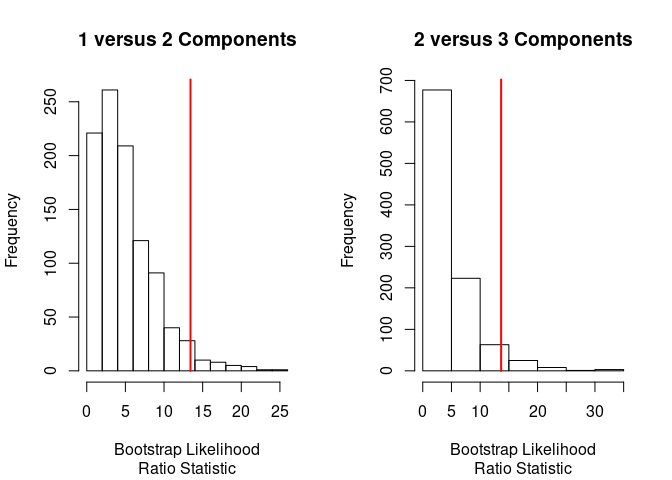
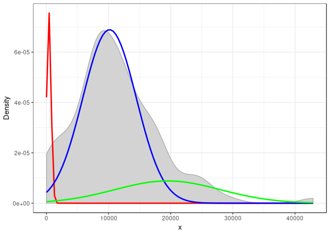

<!-- README.md is generated from README.Rmd. Please edit that file -->

# GMMClassifier

The goal of GMMClassifier is to classify single cells (as expression
matrix of scRNA-seq data) into subtypes using **G**aussian **M**ixture
**M**odel, and to find out the mapping relationship among subtypes
across datasets (of different batch).

## Installation

You can install the latest version of GMMClassifier with:

``` r
install.packages("devtools")
devtools::install_github("GMMClassifier")
```

## About example data

The example data used in this project is part of
[GSE81861](https://www.ncbi.nlm.nih.gov/geo/query/acc.cgi?acc=GSE81861)
of [this paper](https://www.nature.com/articles/ng.3818#accessions).
First, the FPKM matrix file of all cells was
downloaded:

``` bash
aria2c ftp://ftp.ncbi.nlm.nih.gov/geo/series/GSE81nnn/GSE81861/suppl/GSE81861_Cell_Line_FPKM.csv.gz
pigz -d GSE81861_Cell_Line_FPKM.csv.gz
```

The matrix was read into R and the columns of two batch were selected as
subsets according to [the results part of the
paper](https://www.nature.com/articles/ng.3818#results) “To assess batch
effects, we performed scRNA–seq in two batches for GM12878
(lymphoblastoid) cells and also for H1 embryonic stem cells. Gene
expression was quantified as fragments per kilobase per million reads
(FPKM), and low-quality cells were discarded on the basis of multiple
metrics”:

``` r
library(data.table)
library(tidyverse)
library(org.Hs.eg.db)
library(usethis)
library(genefilter)
library(Biobase)
rowVars <- function(x, ...) {
  rowSums((x - rowMeans(x, ...))^2, ...)/(dim(x)[2] - 1)
}
cl <- fread('GSE81861_Cell_Line_FPKM.csv')
names(cl)[1] <- 'Gene'
cl <- cl[, Ensembl := str_match(Gene, ".+_(.+)\\.\\d+$")[, 2]]
symbols <- mapIds(org.Hs.eg.db, keys = cl$Ensembl, keytype = "ENSEMBL", column="ENTREZID", multiVals = 'first')
cl <- cl[, Entrez := symbols[Ensembl]]
cl <- cl[, c('Gene', 'Ensembl'):= NULL]
cl.b1 <- cbind(cl[, .(Entrez)], cl[, .SD, .SDcols = names(cl) %like% "_B1_"])
cl.b2 <- cbind(cl[, .(Entrez)], cl[, .SD, .SDcols = names(cl) %like% "_B2_"])
cl <- lapply(list(cl.b1, cl.b2), function(x) x[, var := rowVars(.SD), .SDcols = -c('Entrez')])
cl <- lapply(cl, function(x) x[, max.var := max(var), by = 'Entrez'][var != 0 & max.var == var & !is.na(Entrez)])
cl <- lapply(cl, function(x) x[, grep("var", colnames(x)) := NULL])
cl <- lapply(cl, function(x) as.data.frame(x) %>% remove_rownames %>% column_to_rownames(var="Entrez"))
cl <- lapply(cl, function(x) new("ExpressionSet", exprs=as.matrix(x), annotation = 'org.Hs.eg.db'))
cl <- lapply(cl, function(x) nsFilter(x, require.entrez = TRUE, require.GOBP = TRUE, require.GOCC = TRUE, require.GOMF = TRUE, var.cutoff = 0.999))
cl.b1 <- exprs(cl[[1]][[1]])
cl.b2 <- exprs(cl[[2]][[1]])
use_data(cl.b1, compress = 'xz')
use_data(cl.b2, compress = 'xz')
```

Thus, the `matrix` object `cl.b1` contains *GM12878* and *H1* cell of
batch 1, and `cl.b2` contains those of batch 2.

## Details for implementation

### How to prepare (lazy-loaded) example data for this R package?

See code in [previous section](#about-example-data). First, all rownames
of matrix were converted into Entrez ID, then the features were filtered
by
[genefilter](https://bioconductor.org/packages/release/bioc/html/genefilter.html)
package based on their GO annotation and variance levels. To use fewer
features for testing, only features with top 0.1% variance were kepted
(about only 14 genes) at the time.

### How to fit a mixture of gaussians to real data?

The
[mixtools](https://cran.r-project.org/web/packages/mixtools/index.html)
package was used for analyzing mixture models as well as
[plotGMM](https://github.com/pdwaggoner/plotGMM) package for visualizing
models.

### How can I determine the best number of components when fitting model?

Package mixtools provides a method using [hypothesis
testing](https://www.stat.cmu.edu/~cshalizi/402/lectures/20-mixture-examples/lecture-20.pdf)
to select number of components. For example:

``` r
library(mixtools)
#> mixtools package, version 1.1.0, Released 2017-03-10
#> This package is based upon work supported by the National Science Foundation under Grant No. SES-0518772.
library(plotGMM)
data(cl.b1)
a.boot <- boot.comp(y = cl.b1[5, ], max.comp = 10, B = 1000, mix.type = "normalmix", epsilon = 1e-3)
#> number of iterations= 49 
#> number of iterations= 170 
#> number of iterations= 53 
#> number of iterations= 16 
#> number of iterations= 12 
#> number of iterations= 58 
#> number of iterations= 133 
#> number of iterations= 58 
#> number of iterations= 20 
#> number of iterations= 129 
#> number of iterations= 101 
#> number of iterations= 18 
#> number of iterations= 5 
#> number of iterations= 14 
#> number of iterations= 49 
...
#> Decision: Select 3 Component(s)
str(a.boot)
#> List of 3
#>  $ p.values   : num [1:3] 0.049 0.041 0.342
#>  $ log.lik    :List of 3
#>   ..$ : num [1:1000] 3.8 2.57 10.75 4.09 5.47 ...
#>   ..$ : num [1:1000] 3.19 2.9 9.73 5.85 3.31 ...
#>   ..$ : num [1:1000] 5.409 4.489 0.605 7.155 8.564 ...
#>  $ obs.log.lik: num [1:3] 13.43 13.66 6.96
```



  - `cl.b1[5, ]` means the 5th row for `data.frame` `cl.b1`.
  - It seems in rare cases the meaning components(`max.comp`) will
    exceed `10`.
  - The number of bootstrap realization of the likelihood ratio
    statistic was set to `1000` for more acceptable results.

The `boot.comp()` function performs the likelihood ratio statistic for
testing the null hypothesis of a k-component fit versus the alternative
hypothesis of a (k+1)-component fit to various mixture models. A p-value
is calculated for each test and once the p-value is above a specified
significance level, the testing terminates.

> The vertical red lines mark the observed difference in
> log-likelihoods.

The value of `length(a.boot$obs.log.lik)` was chosen as optimized number
of
components.

### How to fit a model?

``` r
# Should not in fast mode: the component densities should be allowed to have different mus and sigmas
a.optim <- normalmixEM(cl.b1[5, ], k = length(a.boot$obs.log.lik))
#> One of the variances is going to zero;  trying new starting values.
#> number of iterations= 117
str(a.optim)
#> List of 9
#>  $ x         : num [1:101] 24.5 472.4 11519.7 17056.2 8822 ...
#>  $ lambda    : num [1:3] 0.0675 0.7436 0.1889
#>  $ mu        : num [1:3] 403 10162 19489
#>  $ sigma     : num [1:3] 354 4305 8516
#>  $ loglik    : num -1024
#>  $ posterior : num [1:101, 1:3] 8.96e-01 9.23e-01 4.24e-215 0.00 1.18e-123 ...
#>   ..- attr(*, "dimnames")=List of 2
#>   .. ..$ : NULL
#>   .. ..$ : chr [1:3] "comp.1" "comp.2" "comp.3"
#>  $ all.loglik: num [1:118] -1063 -1033 -1031 -1031 -1030 ...
#>  $ restarts  : num 1
#>  $ ft        : chr "normalmixEM"
#>  - attr(*, "class")= chr "mixEM"
plot_GMM(a.optim, k = length(a.boot$obs.log.lik))
```



Function `normalmixEM` was used to fit a Gaussian Mixture Model. The
used number of components was obtained by previous step.

### How to rate components?

To rate a feature, we first rated each component in a model:

  - The mean posterior of each component must \> 0.9:

<!-- end list -->

``` r
apply(a.optim$posterior, 2, mean) > 0.9
#> comp.1 comp.2 comp.3 
#>  FALSE  FALSE  FALSE
```

  - The [overlapping coefficient
    (OVL)](https://stats.stackexchange.com/q/12216) of the component
    must \< 0.05:

<!-- end list -->

``` r
get_overlap_coef <- function(mu1, mu2, sd1, sd2){
  xs  <- seq(min(mu1 - 4 * sd1, mu2 - 4 * sd2), 
             max(mu1 + 4 * sd1, mu2 + 4 * sd2), 
             length.out = 500)
  f1  <- dnorm(xs, mean = mu1, sd = sd1)
  f2  <- dnorm(xs, mean = mu2, sd = sd2)
  int <- xs[which.max(pmin(f1, f2))]
  l   <- pnorm(int, mu1, sd1, lower.tail = mu1 > mu2)
  r   <- pnorm(int, mu2, sd2, lower.tail = mu1 < mu2)
  l+r
}

get_ovl_iterly <- function(x) {
  # Use nested lapply for calculating one with the others
  ovl <- lapply(seq_len(length(x[['mu']])), function(a) lapply(seq_len(length(x[['mu']])), function(b) ifelse(a == b, NA, get_overlap_coef(x[['mu']][a], x[['mu']][b], x[['sigma']][a], x[['sigma']][b]))))
  (ovl <- lapply(lapply(ovl, unlist), function(x) x[!is.na(x)]))
}

(ovls <- get_ovl_iterly(a.optim))
#> [[1]]
#> [1] 0.02312081 0.01819388
#> 
#> [[2]]
#> [1] 0.02312081 0.42728836
#> 
#> [[3]]
#> [1] 0.01819388 0.42728836

lapply(ovls, function(x) all(x < 0.05))
#> [[1]]
#> [1] TRUE
#> 
#> [[2]]
#> [1] FALSE
#> 
#> [[3]]
#> [1] FALSE
```

For instance, the return value of function `get_ovl_iterly()` above is a
list contains three elements, each of which is OVLs between one
component and others. Finally, each component was tested if all OVLs
were smaller than 0.05.

### How to get the (absolute) size of components?

Mixture model provides only
[“soft-labels”](http://tinyheero.github.io/2015/10/13/mixture-model.html)
(quite different from algorithm like k-means who brings “hard-labels”)
for samples, which means it need “threshold” for assigning sample to
components. Here each of samples was assigned to the component with the
biggest posterior probability:

``` r
ab.size <- vector('integer', length = ncol(a.optim$posterior))
names(ab.size) <- colnames(a.optim$posterior)
tmp.size <- table(apply(a.optim$posterior, 1, function(x) colnames(a.optim$posterior)[which.max(x)]))
# Must use <<- here: both <- and assign() do NOT work due to scope
invisible(lapply(names(tmp.size), function(x) ab.size[[x]] <<- tmp.size[x]))
ab.size
#> comp.1 comp.2 comp.3 
#>      8     83     10
```

## Questions

1.  What’s the difference between “**totally relative percentage**” and
    “**currently relative percentage**” when rating components?

<!-- end list -->

``` r
# We have lambda as relative percentage of each components
# But I don't know if the difference
a.optim$lambda
#> [1] 0.06746598 0.74362853 0.18890549
```

2.  Which method should be used to (or be implemented as **alternative
    methods** can be chosen) filter features before fitting the model?
    One could be filtering based on information of Gene Ontology and
    variance levels as previous description of data preparation, and
    others?

3.  **Which threshold values** during rating should be implemented as
    parameters that can be set by user?

<!-- end list -->

  - Mean posterior: \> 0.9
  - Overlapping coefficient: \< 0.05
  - Absolute size: \> 20 cells (of 1966 cells, isn’t 1%?)
  - Totally relative percentage: 0.005 ~ 0.995
  - Currently relative percentage: 0.05 ~ 0.95

<!-- end list -->

3.  Should some of these threshold values be tuned by **machine
    learning** but **not fixed values**? If so, which method should be
    used?

## TODO list (sorted by priority in descending order)

  - \[ \] Finish the function for ranking features with rated
    components.
  - \[ \] Finish the main function with parameters.
  - \[ \] Design a method for visualizing the final pseudo decision
    tree.
  - \[ \] The result of fitting is somewhat random at the time. Try to
    make it reproducible when needed.
  - \[ \] Hide the plotting result of `boot.comp()`. Only keep it in
    test mode.
