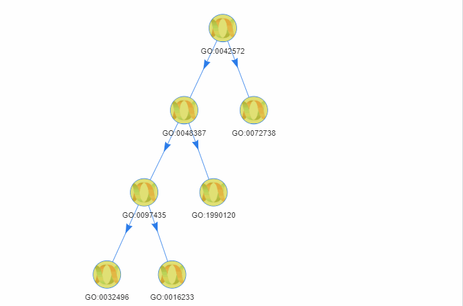

<!-- README.md is generated from README.Rmd. Please edit that file -->

# CrossSCC

The goal of CrossSCC is to classify **S**ingle-**C**ell data(as
expression matrix of scRNA-seq data) **Cross**ing batch into
**C**lusters using Gaussian Mixture Model, and to find out the mapping
relationship in clusters.


## Installation

You can install the latest version of CrossSCC with:

``` r
install.packages("remotes")
remotes::install_github("bioinformatist/CrossSCC")
```

## Example dataset

The example data used in this project is part of
[GSE81861](https://www.ncbi.nlm.nih.gov/geo/query/acc.cgi?acc=GSE81861)
from [this paper](https://www.nature.com/articles/ng.3818#accessions).
First, the FPKM matrix file of all cells was
downloaded:

``` bash
aria2c ftp://ftp.ncbi.nlm.nih.gov/geo/series/GSE81nnn/GSE81861/suppl/GSE81861_Cell_Line_FPKM.csv.gz
pigz -d GSE81861_Cell_Line_FPKM.csv.gz
```

### Five types as well as batch 1 of two types

``` r
cl <- fread('GSE81861_Cell_Line_FPKM.csv')
names(cl)[1] <- 'Gene'
cl[, Ensembl := str_match(Gene, ".+_(.+)\\.\\d+$")[, 2]]
symbols <- mapIds(org.Hs.eg.db, keys = cl$Ensembl, keytype = "ENSEMBL", column="ENTREZID", multiVals = 'first')
cl[, Entrez := symbols[Ensembl]]
cl[, c('Gene', 'Ensembl'):= NULL]
cl <- cbind(cl[, .(Entrez)], cl[, .SD, .SDcols = !(names(cl) %like% "_B2_")])
cl[, var := rowVars(.SD), .SDcols = -c('Entrez')]
cl <- cl[, max.var := max(var), by = 'Entrez'][var != 0 & max.var == var & !is.na(Entrez), ]
cl[, grep("var", colnames(cl)) := NULL]
cl <- as.data.frame(cl) %>% remove_rownames %>% column_to_rownames(var = "Entrez")
cl <- cl[, !(names(cl) %in% 'Entrez')]
cl.7 <- new("ExpressionSet", exprs=as.matrix(cl), annotation = 'org.Hs.eg.db')
# setwd() back to package root directory
use_data(cl.7, compress = 'xz')
```

## How to use & performance

``` r
library(CrossSCC)
#> Loading required package: R.utils
#> Loading required package: R.oo
#> Loading required package: R.methodsS3
#> R.methodsS3 v1.7.1 (2016-02-15) successfully loaded. See ?R.methodsS3 for help.
#> R.oo v1.23.0 successfully loaded. See ?R.oo for help.
#> 
#> Attaching package: 'R.oo'
#> The following object is masked from 'package:R.methodsS3':
#> 
#>     throw
#> The following objects are masked from 'package:methods':
#> 
#>     getClasses, getMethods
#> The following objects are masked from 'package:base':
#> 
#>     attach, detach, load, save
#> R.utils v2.9.2 successfully loaded. See ?R.utils for help.
#> 
#> Attaching package: 'R.utils'
#> The following object is masked from 'package:utils':
#> 
#>     timestamp
#> The following objects are masked from 'package:base':
#> 
#>     cat, commandArgs, getOption, inherits, isOpen, parse, warnings
#> Loading required package: snow
#> 
data("cl.7")
(handsome.zuo <- CrossSCC(cl.7, ncores = 16, mean.posterior.cutoff = 3.000000e-01, ovl.cutoff = 4.588144e-01, mean.posterior.weight = 2.220446e-16, ovl.weight = 2.220446e-16, lambda.cutoff = 5.198353e-01, verbose = FALSE))
#> Warning in searchCommandline(parallel, cpus = cpus, type = type,
#> socketHosts = socketHosts, : Unknown option on commandline:
#> rmarkdown::render('/home/ysun/github.com/bioinformatist/GMMClassifier/
#> README.Rmd',~+~~+~encoding~+~

#> Warning in searchCommandline(parallel, cpus = cpus, type = type,
#> socketHosts = socketHosts, : Unknown option on commandline:
#> rmarkdown::render('/home/ysun/github.com/bioinformatist/GMMClassifier/
#> README.Rmd',~+~~+~encoding~+~

#> Warning in searchCommandline(parallel, cpus = cpus, type = type,
#> socketHosts = socketHosts, : Unknown option on commandline:
#> rmarkdown::render('/home/ysun/github.com/bioinformatist/GMMClassifier/
#> README.Rmd',~+~~+~encoding~+~

#> Warning in searchCommandline(parallel, cpus = cpus, type = type,
#> socketHosts = socketHosts, : Unknown option on commandline:
#> rmarkdown::render('/home/ysun/github.com/bioinformatist/GMMClassifier/
#> README.Rmd',~+~~+~encoding~+~

#> Warning in searchCommandline(parallel, cpus = cpus, type = type,
#> socketHosts = socketHosts, : Unknown option on commandline:
#> rmarkdown::render('/home/ysun/github.com/bioinformatist/GMMClassifier/
#> README.Rmd',~+~~+~encoding~+~

#> Warning in searchCommandline(parallel, cpus = cpus, type = type,
#> socketHosts = socketHosts, : Unknown option on commandline:
#> rmarkdown::render('/home/ysun/github.com/bioinformatist/GMMClassifier/
#> README.Rmd',~+~~+~encoding~+~

#> Warning in searchCommandline(parallel, cpus = cpus, type = type,
#> socketHosts = socketHosts, : Unknown option on commandline:
#> rmarkdown::render('/home/ysun/github.com/bioinformatist/GMMClassifier/
#> README.Rmd',~+~~+~encoding~+~

#> Warning in searchCommandline(parallel, cpus = cpus, type = type,
#> socketHosts = socketHosts, : Unknown option on commandline:
#> rmarkdown::render('/home/ysun/github.com/bioinformatist/GMMClassifier/
#> README.Rmd',~+~~+~encoding~+~

#> Warning in searchCommandline(parallel, cpus = cpus, type = type,
#> socketHosts = socketHosts, : Unknown option on commandline:
#> rmarkdown::render('/home/ysun/github.com/bioinformatist/GMMClassifier/
#> README.Rmd',~+~~+~encoding~+~

#> Warning in searchCommandline(parallel, cpus = cpus, type = type,
#> socketHosts = socketHosts, : Unknown option on commandline:
#> rmarkdown::render('/home/ysun/github.com/bioinformatist/GMMClassifier/
#> README.Rmd',~+~~+~encoding~+~

#> Warning in searchCommandline(parallel, cpus = cpus, type = type,
#> socketHosts = socketHosts, : Unknown option on commandline:
#> rmarkdown::render('/home/ysun/github.com/bioinformatist/GMMClassifier/
#> README.Rmd',~+~~+~encoding~+~

#> Warning in searchCommandline(parallel, cpus = cpus, type = type,
#> socketHosts = socketHosts, : Unknown option on commandline:
#> rmarkdown::render('/home/ysun/github.com/bioinformatist/GMMClassifier/
#> README.Rmd',~+~~+~encoding~+~

#> Warning in searchCommandline(parallel, cpus = cpus, type = type,
#> socketHosts = socketHosts, : Unknown option on commandline:
#> rmarkdown::render('/home/ysun/github.com/bioinformatist/GMMClassifier/
#> README.Rmd',~+~~+~encoding~+~

#> Warning in searchCommandline(parallel, cpus = cpus, type = type,
#> socketHosts = socketHosts, : Unknown option on commandline:
#> rmarkdown::render('/home/ysun/github.com/bioinformatist/GMMClassifier/
#> README.Rmd',~+~~+~encoding~+~

#> Warning in searchCommandline(parallel, cpus = cpus, type = type,
#> socketHosts = socketHosts, : Unknown option on commandline:
#> rmarkdown::render('/home/ysun/github.com/bioinformatist/GMMClassifier/
#> README.Rmd',~+~~+~encoding~+~

#> Warning in searchCommandline(parallel, cpus = cpus, type = type,
#> socketHosts = socketHosts, : Unknown option on commandline:
#> rmarkdown::render('/home/ysun/github.com/bioinformatist/GMMClassifier/
#> README.Rmd',~+~~+~encoding~+~
#>                                  levelName
#> 1  GO:0006826                             
#> 2   ¦--LOC109864269                       
#> 3   ¦   ¦--LOC109864269\nsub-component 1  
#> 4   ¦   °--LOC109864269\nsub-component 2  
#> 5   °--GO:0034341                         
#> 6       ¦--GO:0060333                     
#> 7       ¦   ¦--GO:0060333\nsub-component 1
#> 8       ¦   °--GO:0060333\nsub-component 2
#> 9       °--GO:0000183                     
#> 10          ¦--GO:0000183\nsub-component 1
#> 11          °--GO:0000183\nsub-component 2
library(data.tree)
handsome.zuo$Get('sampleNames', filterFun = isLeaf, simplify = FALSE)
#> $`LOC109864269\nsub-component 1`
#>   [1] "RHB1118__GM12878_B1__orange" "RHB1169__GM12878_B1__orange"
#>   [3] "RHB1185__GM12878_B1__orange" "RHB1201__GM12878_B1__orange"
#>   [5] "RHL995__H1437__red"          "RHL996__H1437__red"         
#>   [7] "RHL999__H1437__red"          "RHL1001__H1437__red"        
#>   [9] "RHL1003__H1437__red"         "RHL1005__H1437__red"        
#>  [11] "RHL1010__H1437__red"         "RHL1011__H1437__red"        
#>  [13] "RHL1012__H1437__red"         "RHL1013__H1437__red"        
#>  [15] "RHL1015__H1437__red"         "RHL1016__H1437__red"        
#>  [17] "RHL1019__H1437__red"         "RHL1022__H1437__red"        
#>  [19] "RHL1033__H1437__red"         "RHL1042__H1437__red"        
#>  [21] "RHL1049__H1437__red"         "RHL1050__H1437__red"        
#>  [23] "RHL1057__H1437__red"         "RHL1059__H1437__red"        
#>  [25] "RHL1062__H1437__red"         "RHL1066__H1437__red"        
#>  [27] "RHL1067__H1437__red"         "RHL1071__H1437__red"        
#>  [29] "RHL1073__H1437__red"         "RHL1075__H1437__red"        
#>  [31] "RHL1077__H1437__red"         "RHL1078__H1437__red"        
#>  [33] "RHL1088__H1437__red"         "RHL1094__H1437__red"        
#>  [35] "RHL1095__H1437__red"         "RHL1096__H1437__red"        
#>  [37] "RHL1099__H1437__red"         "RHL1100__H1437__red"        
#>  [39] "RHL1102__H1437__red"         "RHL1103__H1437__red"        
#>  [41] "RHL1104__H1437__red"         "RHL1105__H1437__red"        
#>  [43] "RHL1106__H1437__red"         "RHL1109__H1437__red"        
#>  [45] "RHL1110__H1437__red"         "RHL1117__H1437__red"        
#>  [47] "RHL1119__H1437__red"         "RHL1133__H1437__red"        
#>  [49] "RHL1135__H1437__red"         "RHL1136__H1437__red"        
#>  [51] "RHL1144__H1437__red"         "RHH1111__HCT116__green"     
#>  [53] "RHH1112__HCT116__green"      "RHH1114__HCT116__green"     
#>  [55] "RHH1116__HCT116__green"      "RHH1118__HCT116__green"     
#>  [57] "RHH1119__HCT116__green"      "RHH1120__HCT116__green"     
#>  [59] "RHH1121__HCT116__green"      "RHH1122__HCT116__green"     
#>  [61] "RHH1123__HCT116__green"      "RHH1124__HCT116__green"     
#>  [63] "RHH1125__HCT116__green"      "RHH1126__HCT116__green"     
#>  [65] "RHH1127__HCT116__green"      "RHH1128__HCT116__green"     
#>  [67] "RHH1129__HCT116__green"      "RHH1130__HCT116__green"     
#>  [69] "RHH1131__HCT116__green"      "RHH1132__HCT116__green"     
#>  [71] "RHH1133__HCT116__green"      "RHH1135__HCT116__green"     
#>  [73] "RHH1136__HCT116__green"      "RHH1137__HCT116__green"     
#>  [75] "RHH1138__HCT116__green"      "RHH1141__HCT116__green"     
#>  [77] "RHH1142__HCT116__green"      "RHH1143__HCT116__green"     
#>  [79] "RHH1144__HCT116__green"      "RHH1145__HCT116__green"     
#>  [81] "RHH1146__HCT116__green"      "RHH1147__HCT116__green"     
#>  [83] "RHH1148__HCT116__green"      "RHH1149__HCT116__green"     
#>  [85] "RHH1150__HCT116__green"      "RHH1151__HCT116__green"     
#>  [87] "RHH1153__HCT116__green"      "RHH1154__HCT116__green"     
#>  [89] "RHH1156__HCT116__green"      "RHH1157__HCT116__green"     
#>  [91] "RHH1158__HCT116__green"      "RHH1160__HCT116__green"     
#>  [93] "RHH1164__HCT116__green"      "RHH1165__HCT116__green"     
#>  [95] "RHH1166__HCT116__green"      "RHH1167__HCT116__green"     
#>  [97] "RHH1169__HCT116__green"      "RHH1170__HCT116__green"     
#>  [99] "RHH1171__HCT116__green"      "RHH1172__HCT116__green"     
#> [101] "RHB1138__IMR90__black"       "RHB1176__IMR90__black"      
#> [103] "RHB1181__IMR90__black"       "RHT021__K562__blue"         
#> [105] "RHT033__K562__blue"          "RHT035__K562__blue"         
#> [107] "RHT047__K562__blue"          "RHT054__K562__blue"         
#> [109] "RHT055__K562__blue"          "RHT064__K562__blue"         
#> [111] "RHT075__K562__blue"          "RHT079__K562__blue"         
#> [113] "RHT085__K562__blue"          "RHT092__K562__blue"         
#> [115] "RHT101__K562__blue"          "RHT110__K562__blue"         
#> 
#> $`LOC109864269\nsub-component 2`
#>  [1] "RHC069__H1_B1__brown" "RHC070__H1_B1__brown" "RHC071__H1_B1__brown"
#>  [4] "RHC072__H1_B1__brown" "RHC073__H1_B1__brown" "RHC074__H1_B1__brown"
#>  [7] "RHC075__H1_B1__brown" "RHC077__H1_B1__brown" "RHC078__H1_B1__brown"
#> [10] "RHC079__H1_B1__brown" "RHC080__H1_B1__brown" "RHC082__H1_B1__brown"
#> [13] "RHC083__H1_B1__brown" "RHC084__H1_B1__brown" "RHC085__H1_B1__brown"
#> [16] "RHC087__H1_B1__brown" "RHC088__H1_B1__brown" "RHC089__H1_B1__brown"
#> [19] "RHC090__H1_B1__brown" "RHC092__H1_B1__brown" "RHC093__H1_B1__brown"
#> [22] "RHC094__H1_B1__brown" "RHC095__H1_B1__brown" "RHC096__H1_B1__brown"
#> [25] "RHC097__H1_B1__brown" "RHC098__H1_B1__brown" "RHC100__H1_B1__brown"
#> [28] "RHC101__H1_B1__brown" "RHC102__H1_B1__brown" "RHC103__H1_B1__brown"
#> [31] "RHC104__H1_B1__brown" "RHC105__H1_B1__brown" "RHC107__H1_B1__brown"
#> [34] "RHC108__H1_B1__brown" "RHC109__H1_B1__brown" "RHC110__H1_B1__brown"
#> [37] "RHC111__H1_B1__brown" "RHC112__H1_B1__brown" "RHC113__H1_B1__brown"
#> [40] "RHC114__H1_B1__brown" "RHC115__H1_B1__brown" "RHC116__H1_B1__brown"
#> [43] "RHC117__H1_B1__brown" "RHC118__H1_B1__brown" "RHC121__H1_B1__brown"
#> [46] "RHC122__H1_B1__brown" "RHC123__H1_B1__brown" "RHC125__H1_B1__brown"
#> [49] "RHC127__H1_B1__brown" "RHC128__H1_B1__brown" "RHC129__H1_B1__brown"
#> [52] "RHC130__H1_B1__brown" "RHC131__H1_B1__brown" "RHC132__H1_B1__brown"
#> [55] "RHC134__H1_B1__brown" "RHC135__H1_B1__brown" "RHC136__H1_B1__brown"
#> [58] "RHC137__H1_B1__brown" "RHC138__H1_B1__brown" "RHC141__H1_B1__brown"
#> [61] "RHC142__H1_B1__brown" "RHC143__H1_B1__brown" "RHC144__H1_B1__brown"
#> [64] "RHC145__H1_B1__brown"
#> 
#> $`GO:0060333\nsub-component 1`
#>  [1] "RHA015__A549__turquoise" "RHA016__A549__turquoise"
#>  [3] "RHA017__A549__turquoise" "RHA018__A549__turquoise"
#>  [5] "RHA028__A549__turquoise" "RHA029__A549__turquoise"
#>  [7] "RHA030__A549__turquoise" "RHA032__A549__turquoise"
#>  [9] "RHA033__A549__turquoise" "RHA034__A549__turquoise"
#> [11] "RHA035__A549__turquoise" "RHA036__A549__turquoise"
#> [13] "RHA037__A549__turquoise" "RHA038__A549__turquoise"
#> [15] "RHA039__A549__turquoise" "RHA040__A549__turquoise"
#> [17] "RHA041__A549__turquoise" "RHA042__A549__turquoise"
#> [19] "RHA043__A549__turquoise" "RHA044__A549__turquoise"
#> [21] "RHA045__A549__turquoise" "RHA046__A549__turquoise"
#> [23] "RHA047__A549__turquoise" "RHA048__A549__turquoise"
#> [25] "RHA049__A549__turquoise" "RHA050__A549__turquoise"
#> [27] "RHA051__A549__turquoise" "RHA052__A549__turquoise"
#> [29] "RHA053__A549__turquoise" "RHA054__A549__turquoise"
#> [31] "RHA055__A549__turquoise" "RHA056__A549__turquoise"
#> [33] "RHA057__A549__turquoise" "RHA058__A549__turquoise"
#> [35] "RHA059__A549__turquoise" "RHA060__A549__turquoise"
#> [37] "RHA061__A549__turquoise" "RHA062__A549__turquoise"
#> [39] "RHA063__A549__turquoise" "RHA064__A549__turquoise"
#> [41] "RHA065__A549__turquoise" "RHA066__A549__turquoise"
#> [43] "RHA067__A549__turquoise" "RHA068__A549__turquoise"
#> [45] "RHA069__A549__turquoise" "RHA070__A549__turquoise"
#> [47] "RHA071__A549__turquoise" "RHA072__A549__turquoise"
#> [49] "RHA073__A549__turquoise" "RHA074__A549__turquoise"
#> [51] "RHA075__A549__turquoise" "RHA077__A549__turquoise"
#> [53] "RHA078__A549__turquoise" "RHA079__A549__turquoise"
#> [55] "RHA080__A549__turquoise" "RHA081__A549__turquoise"
#> [57] "RHA084__A549__turquoise" "RHA085__A549__turquoise"
#> [59] "RHA086__A549__turquoise" "RHA087__A549__turquoise"
#> [61] "RHA089__A549__turquoise" "RHA091__A549__turquoise"
#> [63] "RHA092__A549__turquoise" "RHA093__A549__turquoise"
#> [65] "RHA094__A549__turquoise" "RHA095__A549__turquoise"
#> [67] "RHA096__A549__turquoise" "RHA097__A549__turquoise"
#> [69] "RHA098__A549__turquoise" "RHA099__A549__turquoise"
#> [71] "RHH1117__HCT116__green"  "RHH1140__HCT116__green" 
#> [73] "RHC081__H1_B1__brown"   
#> 
#> $`GO:0060333\nsub-component 2`
#>  [1] "RHA076__A549__turquoise"     "RHA082__A549__turquoise"    
#>  [3] "RHB1116__GM12878_B1__orange" "RHB1140__GM12878_B1__orange"
#>  [5] "RHB1146__GM12878_B1__orange" "RHB1147__GM12878_B1__orange"
#>  [7] "RHB1158__GM12878_B1__orange" "RHB1165__GM12878_B1__orange"
#>  [9] "RHB1172__GM12878_B1__orange" "RHB1200__GM12878_B1__orange"
#> [11] "RHB1205__GM12878_B1__orange" "RHB1206__GM12878_B1__orange"
#> [13] "RHB1207__GM12878_B1__orange" "RHB1130__IMR90__black"      
#> [15] "RHB1133__IMR90__black"       "RHB1134__IMR90__black"      
#> [17] "RHB1136__IMR90__black"       "RHB1139__IMR90__black"      
#> [19] "RHB1143__IMR90__black"       "RHB1144__IMR90__black"      
#> [21] "RHB1152__IMR90__black"       "RHB1157__IMR90__black"      
#> [23] "RHB1160__IMR90__black"       "RHB1168__IMR90__black"      
#> [25] "RHB1174__IMR90__black"       "RHB1175__IMR90__black"      
#> [27] "RHB1178__IMR90__black"       "RHB1180__IMR90__black"      
#> [29] "RHB1183__IMR90__black"       "RHB1187__IMR90__black"      
#> [31] "RHB1202__IMR90__black"       "RHB1203__IMR90__black"      
#> 
#> $`GO:0000183\nsub-component 1`
#>  [1] "RHA031__A549__turquoise"     "RHA088__A549__turquoise"    
#>  [3] "RHB1122__GM12878_B1__orange" "RHB1124__GM12878_B1__orange"
#>  [5] "RHB1129__GM12878_B1__orange" "RHB1141__GM12878_B1__orange"
#>  [7] "RHB1153__GM12878_B1__orange" "RHB1167__GM12878_B1__orange"
#>  [9] "RHB1171__GM12878_B1__orange" "RHB1173__GM12878_B1__orange"
#> [11] "RHB1188__GM12878_B1__orange" "RHB1189__GM12878_B1__orange"
#> [13] "RHB1193__GM12878_B1__orange" "RHB1204__GM12878_B1__orange"
#> [15] "RHB1208__GM12878_B1__orange" "RHB1125__GM12878_B1__orange"
#> [17] "RHB1179__IMR90__black"       "RHC124__H1_B1__brown"       
#> [19] "RHC140__H1_B1__brown"        "RHT018__K562__blue"         
#> [21] "RHT019__K562__blue"          "RHT022__K562__blue"         
#> [23] "RHT038__K562__blue"          "RHT044__K562__blue"         
#> [25] "RHT050__K562__blue"          "RHT052__K562__blue"         
#> [27] "RHT053__K562__blue"          "RHT061__K562__blue"         
#> [29] "RHT062__K562__blue"          "RHT067__K562__blue"         
#> [31] "RHT069__K562__blue"          "RHT071__K562__blue"         
#> [33] "RHT072__K562__blue"          "RHT083__K562__blue"         
#> [35] "RHT088__K562__blue"          "RHT090__K562__blue"         
#> [37] "RHT091__K562__blue"          "RHT096__K562__blue"         
#> [39] "RHT098__K562__blue"          "RHT102__K562__blue"         
#> [41] "RHT109__K562__blue"         
#> 
#> $`GO:0000183\nsub-component 2`
#>  [1] "RHB1162__GM12878_B1__orange" "RHB1197__GM12878_B1__orange"
#>  [3] "RHB1199__GM12878_B1__orange" "RHC120__H1_B1__brown"       
#>  [5] "RHC146__H1_B1__brown"        "RHT023__K562__blue"         
#>  [7] "RHT025__K562__blue"          "RHT029__K562__blue"         
#>  [9] "RHT030__K562__blue"          "RHT036__K562__blue"         
#> [11] "RHT039__K562__blue"          "RHT040__K562__blue"         
#> [13] "RHT041__K562__blue"          "RHT042__K562__blue"         
#> [15] "RHT043__K562__blue"          "RHT045__K562__blue"         
#> [17] "RHT046__K562__blue"          "RHT048__K562__blue"         
#> [19] "RHT049__K562__blue"          "RHT051__K562__blue"         
#> [21] "RHT056__K562__blue"          "RHT057__K562__blue"         
#> [23] "RHT058__K562__blue"          "RHT059__K562__blue"         
#> [25] "RHT060__K562__blue"          "RHT063__K562__blue"         
#> [27] "RHT074__K562__blue"          "RHT080__K562__blue"         
#> [29] "RHT081__K562__blue"          "RHT082__K562__blue"         
#> [31] "RHT086__K562__blue"          "RHT089__K562__blue"         
#> [33] "RHT093__K562__blue"          "RHT094__K562__blue"         
#> [35] "RHT097__K562__blue"          "RHT099__K562__blue"         
#> [37] "RHT100__K562__blue"          "RHT103__K562__blue"         
#> [39] "RHT104__K562__blue"          "RHT105__K562__blue"         
#> [41] "RHT106__K562__blue"          "RHT112__K562__blue"         
#> [43] "RHT113__K562__blue"
library(stringr)
cl1 <- factor(str_match(colnames(cl.7), '__(.+?)_')[, 2])
levels(cl1) <- seq_len(7)
cl1 <- as.character(cl1)
cl2 <- unname(lapply(rapply(handsome.zuo$Get('sampleNames', filterFun = isLeaf), enquote, how = 'unlist'), eval))
cl2 <- vapply(colnames(cl.7), function(y) which(vapply(cl2, function(x) y %in% x, logical(1))), 2333, USE.NAMES = FALSE)
library(clues)
adjustedRand(cl1, cl2, 'Rand')
#>      Rand 
#> 0.8785643
```

## Interactive visualization

``` r
plot_CrossSCC(handsome.zuo)
```



## Find best parameter combination by Bayesion Optimization

``` r
library(rBayesianOptimization)
library(CrossSCC)
library(data.tree)
library(stringr)
library(clues)
data("cl.7")
test.CrossSCC <- function(mean.posterior.cutoff, ovl.cutoff, mean.posterior.weight, ovl.weight, lambda.cutoff) {
  tryCatch(
    {handsome.zuo <- CrossSCC(cl.7, ncores = 16, verbose = FALSE,
                                            mean.posterior.cutoff = mean.posterior.cutoff,
                           ovl.cutoff = ovl.cutoff, mean.posterior.weight = mean.posterior.weight,
                           ovl.weight = ovl.weight, lambda.cutoff = lambda.cutoff)
    cl1 <- factor(str_match(colnames(cl.7), '__(.+?)_')[, 2])
    levels(cl1) <- seq_len(7)
    cl1 <- as.character(cl1)
    cl2 <- unlist(handsome.zuo$Get('sampleNames', filterFun = isLeaf, simplify = FALSE))
    cl2 <- factor(str_match(cl2, '__(.+?)_')[, 2])
    levels(cl2) <- seq_len(7)
    cl2 <- as.character(cl2)
    list(Score = adjustedRand(cl1, cl2, 'Rand'), Pred = 0)}, error=function(e) list(Score = 0, Pred = 0)
  )
}

opt.res <- BayesianOptimization(test.CrossSCC,
                                bounds = list(mean.posterior.cutoff = c(0, 0.5), ovl.cutoff = c(0, 0.5),
                                              mean.posterior.weight = c(0, 1), ovl.weight = c(0, 1),
                                              lambda.cutoff = c(0.5, 1)),
                                init_points = 20, n_iter = 100)
```

## Acknowledgement

  - Thanks to [ScreenToGif](https://github.com/NickeManarin/ScreenToGif)
    for producing gif images for this repo.
  - Thanks to [Dr. Qi Zhao](http://seqworld.com) at SYSUCC for
    suggestions on tree data structure and user experience.
